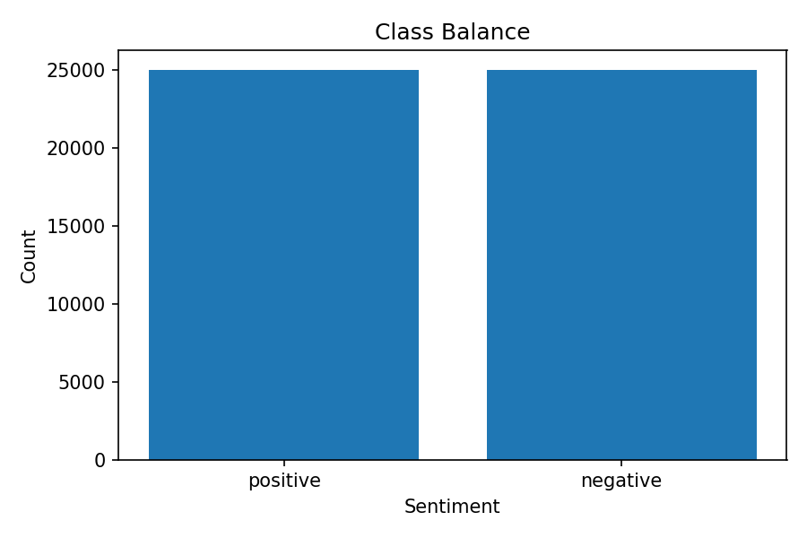
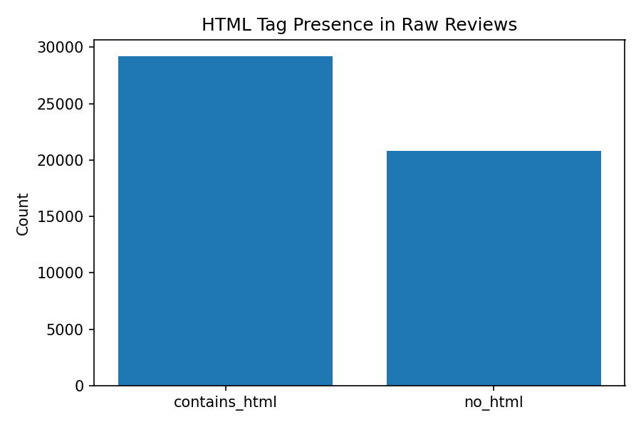
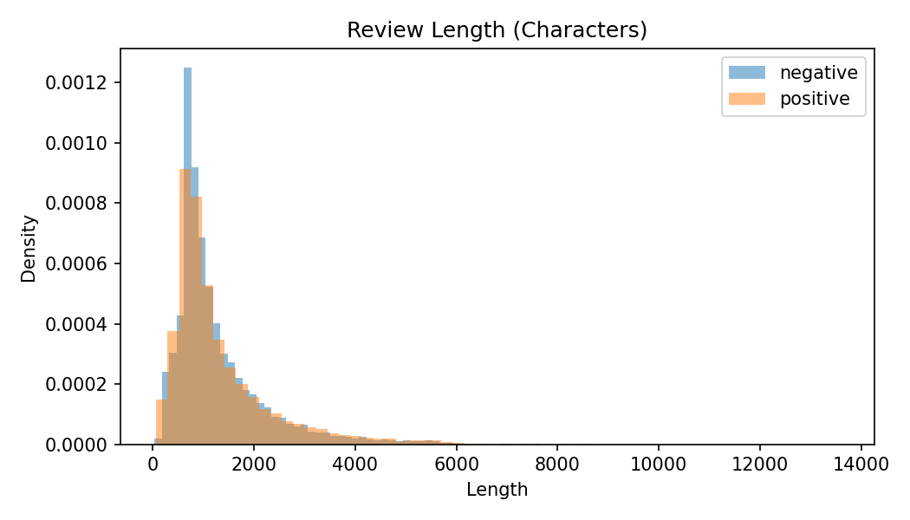
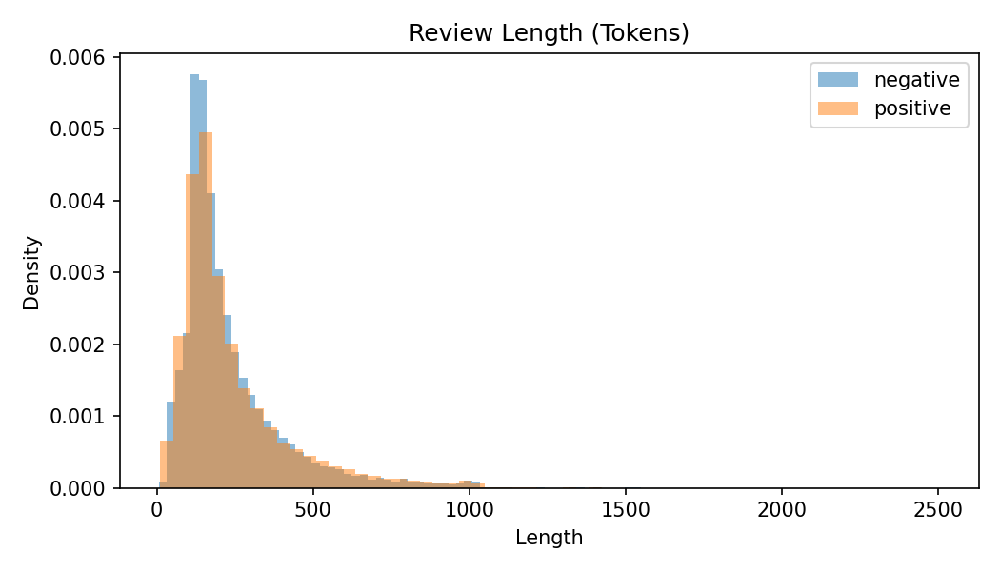

# Exploratory Data Analysis (EDA)

The script **`work/run_eda.py`** with the **`eda`** subcommand runs exploratory data analysis on the raw IMDB movie review dataset. It loads the CSV (columns `review` and `sentiment`), optionally applies the same preprocessing used for training (strip HTML, lowercase), and produces summary statistics plus several visualizations. All outputs are written to a configurable directory (default **`work/eda/`**).

The following sections describe each analysis and the corresponding diagram produced.

---

## 1. Class Balance

**What it does:** Counts how many reviews belong to each sentiment class (positive vs negative) and checks whether the dataset is balanced. Label values are normalized (e.g. `"pos"` → `"positive"`, `"neg"` → `"negative"`) so that all variants are grouped correctly.

**Why it matters:** A balanced dataset reduces the risk of the model being biased toward the majority class. Severe imbalance would suggest a need for resampling or class weights during training.

**Diagram:** A bar chart with sentiment on the x-axis and count on the y-axis. Each bar shows the number of reviews for that class. The IMDB dataset has roughly 25,000 positive and 25,000 negative reviews, so the two bars are nearly equal in height.



---

## 2. HTML Tag Presence in Raw Reviews

**What it does:** For each raw review (before any preprocessing), checks whether it contains at least one HTML tag (any substring matching the pattern `<...>`). It then counts how many reviews contain HTML and how many do not.

**Why it matters:** Many IMDB reviews include markup (e.g. `<br />` for line breaks). Knowing how many reviews contain HTML justifies the preprocessing step that strips or normalizes these tags before training and inference.

**Diagram:** A bar chart with two categories on the x-axis: **contains_html** and **no_html**. The y-axis is the count of reviews. Typically a large share of reviews fall in **contains_html**, with a smaller but still substantial number in **no_html**.



---

## 3. Review Length (Characters)

**What it does:** For each review, computes the length in **characters** (after the optional preprocessing). It then plots the distribution of these lengths separately for negative and positive reviews as overlaid density histograms (same number of bins, density on y-axis so the two sentiment groups are comparable).

**Why it matters:** Character length helps assess document size and whether truncation or padding is needed (e.g. for transformers). Comparing negative vs positive shows if one class tends to be longer or shorter, which can inform feature design or sampling.

**Diagram:** A density histogram with **Length** (characters) on the x-axis and **Density** on the y-axis. Two overlaid series (e.g. light blue for negative, orange for positive) show that both classes have a similar, right-skewed distribution—most reviews are a few hundred to a couple thousand characters, with a long tail of longer reviews.



---

## 4. Review Length (Tokens)

**What it does:** For each review, computes the length in **tokens** using a simple word tokenizer: the number of contiguous word characters (regex `\b\w+\b`) in the preprocessed text. As with character length, it plots the distribution of token counts by sentiment as overlaid density histograms.

**Why it matters:** Token length is directly relevant to models that work on word-level or subword-level inputs (e.g. TF-IDF or transformer max_length). The plot shows whether typical review lengths are within model limits and whether the two sentiment classes differ in token count.

**Diagram:** A density histogram with **Length** (tokens) on the x-axis and **Density** on the y-axis. Again two overlaid series (negative and positive) show a similar, right-skewed shape—most reviews are in the low hundreds of tokens, with density dropping for longer reviews.



---

## Other EDA Outputs

- **`run_args.json`** — Records the command-line options used (data path, output dir, strip_html, lowercase, n-gram options, etc.).
- **`summary.json`** — High-level summary: row count, label counts, preprocessing settings, and the fraction of raw reviews that contain a `<br` tag.
- **N-gram analysis** (optional, disabled with `--skip-ngrams`): Builds a TF-IDF matrix on a sample of cleaned reviews, then computes mean TF-IDF per class and the difference (positive minus negative). Top n-grams per class and top discriminative n-grams are written to **`top_ngrams.json`** (or errors to **`top_ngrams_error.txt`**). This part does not produce images; it is numerical/JSON only.

To reproduce the EDA and regenerate the images:

```bash
python work/run_eda.py eda --data-path "work/IMDB Dataset.csv" --output-dir "work/eda"
```
