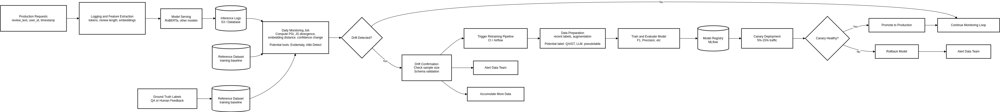

# bonus tasks

> Bonus Task Optional)  
> Design a Mechanism to Detect Model Degradation and Redeploy the Service  
> Propose a strategy for detecting performance degradation in production (e.g., data drift, drop in prediction  
> accuracy).  
> Additionally, suggest how you would automatically retrain or redeploy the model if such degradation is detected  
> (conceptual level only is fine)



## What to monitor (signals & metrics)

When monitoring a deployed sentiment model (for example on the **IMDb** dataset), track both **label-free signals** (fast, available immediately) and **labelled performance metrics** (slower, higher fidelity):

**A. Input / feature monitoring (label-free)**
- Token / vocabulary frequency histograms (top-K tokens).
- OOV / unseen token rate (percent of tokens not present in training vocab).
- Average review length (tokens / characters).
- Embedding drift: distance between average sentence embeddings for production vs. training (cosine or Euclidean).
- Per-feature Population Stability Index (PSI) or KS test for numeric features derived from text (e.g., length, punctuation count).

**B. Prediction / model-output monitoring (label-free)**
- Prediction distribution (percentage positive vs negative).
- Prediction confidence histogram (e.g., % predictions with confidence < 0.6).
- Rate of low-confidence predictions and changes in the tail of confidence distribution.

**C. Performance monitoring (requires labels or human annotation)**
- Rolling accuracy, precision, recall, F1 computed on recently labeled examples.
- Human QA disagreement rate (how often human reviewers disagree with the model).
- Business proxies (e.g., user complaint rate).

**Monitoring cadence & windows**
- Real-time logging for per-request signals.
- Daily or rolling 7-day windows for computing distribution statistics and drift metrics.
- Weekly or on-arrival evaluation for labeled metrics (depending on label latency).

## Drift detection algorithms / tests (which to pick and why)

Below are commonly used tests for distributional change, why they are useful for text-based sentiment systems, and short example calculations. Where applicable a one-line formula is provided and a worked toy example using token frequencies.

### 1. KL divergence (Kullback–Leibler divergence)
**What it measures:** how much one probability distribution diverges from another (asymmetric). Good for comparing token probability distributions.  
**Formula (discrete):**  
`KL(P || Q) = sum_i P(i) * log( P(i) / Q(i) )`  
**Note:** KL is undefined if Q(i)=0 for any i with P(i)>0, so smooth or clip probabilities.  
**Toy example (token probs):**

Training dataset token frequencies:
```
token    probability
good     0.30
bad      0.20
movie    0.40
boring   0.10
```
Production dataset token frequencies:
```
token    probability
good     0.10
bad      0.30
movie    0.40
boring   0.20
```
Compute (example, base e logs):  
`KL(P||Q) = 0.30*ln(0.30/0.10) + 0.20*ln(0.20/0.30) + 0.40*ln(0.40/0.40) + 0.10*ln(0.10/0.20)`

### 2. JS divergence (Jensen–Shannon)
**What it measures:** symmetric variant of KL that is bounded and safer for interpretation. Good default for histogram comparisons.  
**Formula (discrete):**  
`M = 0.5*(P + Q)`  
`JS(P||Q) = 0.5*KL(P||M) + 0.5*KL(Q||M)`  
**Example:** use the same token tables as above; compute M and then JS. JS is always finite and symmetric; often more stable than KL.

### 3. Hellinger distance
**What it measures:** sqrt sum of squared differences between sqrt of probabilities — a bounded metric (0..1). Good for comparing categorical histograms.  
**Formula (discrete):**  
`H(P,Q) = (1/sqrt(2)) * sqrt( sum_i ( sqrt(P(i)) - sqrt(Q(i)) )^2 )`  
**Example:** compute sqrt of each token probability, take differences, square and sum, then scale.

### 4. Population Stability Index (PSI)
**What it measures:** shift in distribution between two populations using binned numeric features (commonly used in credit / risk, but also applied to numeric features derived from text). Interpretable thresholds exist (e.g., PSI > 0.2 may indicate significant shift).  
**Formula (binned):**  
`PSI = sum_b ( (actual_pct_b - expected_pct_b) * ln(actual_pct_b / expected_pct_b) )`  
**Example:** bin a numeric feature (e.g., review length) into buckets, compute expected (train) and actual (prod) percentages per bucket, then apply formula.

### 5. Kolmogorov–Smirnov (KS) test
**What it measures:** a nonparametric test comparing two continuous distributions (tests whether they come from same distribution). Returns a statistic and p-value. Useful for numeric features (lengths, embedding dimensions aggregated).  
**One-line idea:** compute maximum difference between empirical CDFs of feature X in train vs prod.  
**Example:** compute ECDF of review lengths in training and production and evaluate KS stat.

### 6. Embedding / vector-based distances (cosine, Wasserstein)
**What it measures:** compare aggregate embedding vectors (e.g., average pooled BERT embeddings) between training and production. Cosine distance or Wasserstein distance on distributions of embeddings can reveal semantic drift even if token-level stats look similar.  
**One-line (cosine between mean embeddings):**  
`cos_sim = (mean_e_train · mean_e_prod) / (||mean_e_train|| * ||mean_e_prod||)`  
**Example:** compute mean CLS embedding for training corpus and production corpus; if cosine similarity drops significantly, semantic drift likely occurred.

## Practical solution design — Option B (recommended / automated retrain pipeline)

This design describes a safe, automated workflow to **detect drift** and **trigger retraining with validation + canary deploy**.

### Architecture overview
1. **Inference logging** — stream or store per-request records including:
   - `request_id`, `timestamp`, `input_text`, `model_version`, `predicted_label`, `prediction_confidence`, `token_count`, and optionally `embedding_vector` (or embedding summary metrics).  
2. **Monitoring service** — daily or hourly job that:
   - reads the most recent `N` requests (sliding window, e.g., last 24h or 7 days),  
   - computes distribution metrics (JS on token histograms, PSI or KS on numeric features, average confidence change, embedding drift),  
   - computes counts and sample sizes to avoid noisy signals on small volumes.  
3. **Trigger logic (guarded)** — define conservative conditions combining multiple signals, for example:
   - `JS(token_hist) > 0.08` **AND** `avg_confidence_drop > 10%` **AND** `min_samples > 1000` → mark “candidate drift”.  
4. **Retrain job** — on candidate drift, automatically start a retrain pipeline (Airflow / GitHub Actions / SageMaker Pipelines / Kubeflow). Steps:
   - Collect **recent labeled data** (see notes below about labeling/pseudolabels).  
   - Prepare dataset (training/validation/holdout) with a time-aware split (e.g., most recent 60% train, 20% val, 20% holdout).  
   - Train the model reproducibly with the same feature pipeline used in production (tokenizer + text preprocessing).  
   - Evaluate candidate model vs current production model on the holdout set and compute bootstrap confidence intervals for metrics.  
   - If candidate model meets pre-defined improvement criteria (e.g., +0.5% absolute F1 or no statistically significant degradation and lower bias on recent examples), push candidate to registry as `canary` version.  
5. **Canary deployment & validation** — route a small percentage of traffic (e.g., 5%) to the canary model for a fixed validation window (e.g., 24 hours). Monitor same drift/performance signals and collect labels or human review samples. If canary passes health checks, promote to full production; else rollback.

### What “pseudolabel” means (and how to use it safely)
**Pseudolabeling** is the process of using model predictions as temporary labels for unlabeled production data to expand training data. In short:
- Use the current model (or an ensemble) to predict labels for unlabeled recent production examples.  
- Optionally filter pseudolabeled examples by **high confidence threshold** (e.g., only take predictions with confidence > 0.95) to reduce noise.  
- Combine pseudolabeled examples with a smaller set of verified labeled examples (human-reviewed) and original training data for retraining.

**Risks & mitigations:**
- **Risk:** model reinforces its mistakes (confirmation bias).  
  **Mitigation:** require human-labeled seed examples before training; use conservative confidence thresholds; use pseudolabels only as supplementary data and weight them lower in loss or sample fewer of them.  
- **Risk:** concept drift means pseudolabels are systematically wrong.  
  **Mitigation:** always keep a holdout of human-labeled recent data for final validation and require improvement there before promotion.

### Notes on thresholds & safety
- Set conservative thresholds initially (to avoid frequent unnecessary retraining). Calibrate on historical data (simulate drift episodes if possible).  
- Always require **holdout validation** and a **canary traffic window** before full promotion.

## Example concrete pipeline (Option B) — step-by-step

1. **Inference logging (service side)**
   - Every inference request writes a JSON line or DB row with: `id, ts, text, model_version, pred, conf, token_count, sample_embedding_summary`.
   - Store logs in S3 / object store or a small DB (e.g., Postgres). Keep retention for at least 30 days.

2. **Daily monitor (scheduled job)**
   - Read `reference` sample (representative training data) and `current` sample (last 24h or 7d).
   - Compute: token histogram JS divergence, PSI for numeric features (e.g., length), mean confidence change, and mean embedding cosine similarity.
   - Apply smoothing (Laplace) on histograms to avoid zeros.
   - Produce a JSON report and alert if combined trigger conditions are met.

3. **Trigger & retrain orchestration**
   - When the monitor marks “candidate drift”, trigger a retrain workflow (e.g., GitHub Actions dispatch or Airflow DAG).
   - Retrain job steps:
     1. **Data gather:** collect recent labeled examples; if labels are sparse, collect a human-review sample (100–500 examples) and create pseudolabels for high-confidence examples (documented and stored separately).
     2. **Data prep:** unify preprocessing, shuffle/time-split with a strict holdout set.
     3. **Training:** run training with fixed seed; save model metadata and training artifacts to model registry (include training data snapshot and code hash).
     4. **Evaluation:** compare candidate vs production on holdout & human-labeled set; compute bootstrapped CIs; check fairness/segmentation if applicable.
     5. **Decision:** if candidate meets criteria, mark model as `canary` and deploy to canary endpoint.

4. **Canary & promote**
   - Route e.g., 5% traffic to canary; validate metrics for 24h; collect labeled samples from canary traffic to confirm real performance.
   - If checks pass, update `prod` alias to candidate version; if not, rollback and investigate.

5. **Model registry & metadata**
   - Use a model registry (or S3 with metadata JSON) to track model versions, training data snapshot, hyperparameters, and evaluation scores for auditing and rollback.

## Practical tips & considerations

- **Label latency:** true performance is only available when labels arrive. Use proxy signals (confidence shifts, embedding drift) to detect issues earlier but confirm with labeled samples.  
- **Threshold calibration:** calibrate thresholds on historical data to balance sensitivity vs false alarms. Consider tiered alerts: informational, warning, critical.  
- **Human-in-the-loop:** incorporate small human review batches regularly (e.g., 100 samples/day) to maintain a labeled stream for validation and to correct pseudolabel drift.  
- **Data leakage avoidance:** ensure reference distributions are strictly based on training data and not contaminated by augmented or test examples.  
- **Reproducibility:** store training code hash, environment, and exact preprocessing steps in model metadata (this makes retraining and auditability straightforward).  
- **Cost tradeoffs:** more frequent retraining + richer monitoring means higher compute cost; pick retrain cadence and monitoring frequency according to the project budget and business risk.  
- **Safety & rollback:** always include an easy rollback path and automated canary evaluation — never promote a model to full production without a validated canary window.
